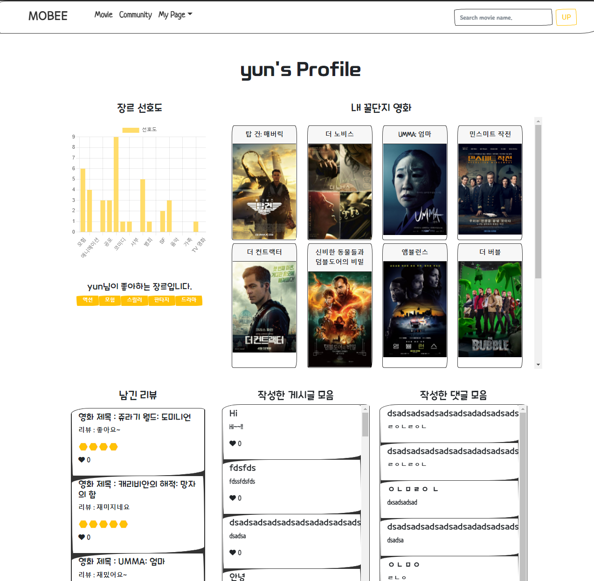

# Movie-Recommender


## 프로젝트 명세서

### 📂 프로젝트 개요

- 프로젝트명 : moBee
- 팀원 : 임윤혁, 백한나
- 업무 분담 내역
  - 임윤혁 : 백앤드 + 프론드엔드 => 기능 담당
  - 백한나: 프론트엔드 + CSS/디자인 => 디자인 담당


### 🤹🏻‍♀️ 기술스택


### 🤔 프로젝트 컨셉

영화 추천, 영화 상세 조회

꿀벌이 추천해주는 꿀잼 영화 추천 사이트


### 🎲 주요 기능 명세

#### 인트로 페이지 (Intro)

- 홈페이지 설명 및 꿀벌(테마) 소개

#### 영화 홈페이지 (Movie Home)

- 모든 영화 조회
  - 최신 순
  - 추천 순(찜한 순)

- 추천 알고리즘에 의한 추천 영화
  - 사용자가 선택한 리뷰 정보와 찜한 정보를 바탕으로 사용자 선호도 조사
  - 찜한 영화와 이미 리뷰를 남긴 영화는 제외하고 선호 장르 기반으로 사용자에게 영화 추천(상위 10개)
  
- 장르별 영화 추천
- 영화 제목을 검색으로 구현(공백 제거하여 검색하도록 했다.)

#### 로그인, 회원가입 페이지

- 노란 테마에 어울리는 미니언즈 이미지 사용하여 구현

#### 커뮤니티 (Community)

- 영화 관련 게시글 (CRUD, 좋아요 기능)
- 최신 순으로 정렬
- 페이지네이션으로 장고에서 10개씩 게시물을 가져오게 구현
- 댓글 CRUD

#### 마이페이지

- 찜한 영화 목록
- 남긴 리뷰 (별점) 목록
- 쓴 게시물과 남긴 댓글 목록
- 알고리즘을 통한 선호 장르 차트 - 장르별 선호도를 표기, 선호도 best 장르 5개 출력
- 관리자인 경우 영화 생성 버튼
  - TMDB로부터 영화를 자동으로 받아오는 버튼 구현(유명한 영화, 상영 중인 영화)
  - 초기에 영화 데이터를 넣어줄 때도 용이(장르도 함께 넣어줌)
  - 추가로 영화 데이터를 버튼을 눌러 생성할 수 있음
  - 받아오고 싶은 page 개수를 정한다(page 1 당 영화 20 개)

#### 영화 상세 페이지 (Movie Detail)

- TMDB 영화 정보 받아오기(장르, 줄거리 등 영화 관련 정보)
- 트레일러 - 유튜브 영상
- 리뷰 CRUD + 별점(생성 수정 시각 정보 포함) ⇒ 누르면 모달로
  - 로그인한 사용자만 작성(본인만 수정, 삭제)
  - 한 계정 당 하나의 평점만
- 출연 배우, 감독 정보 => DB에서 가져오지 않고 상세 정보 시 movie id를 활용해 TMDB에서 가져온다.
- 보고 싶은 영화 등록 버튼(찜)


---

## 📚 목업 설계

- 발사믹 목업 활용

- 초기 목업 디자인

  

  

## 👩‍👦‍👦 ERD 관계도(DB) 설계

ERD 정보 - ERD Diagram


---

## 🎨 CSS / 디자인

- 전체적인 테마: [Bootswatch](https://bootswatch.com/sketchy/), 부트스트랩

- 움직이는 이미지: [CodePen](https://codepen.io/trending)

- 아이콘: [fontawesome](https://fontawesome.com/), [flaticon](https://www.flaticon.com/)

- 폰트: [눈누](https://noonnu.cc/), [구글폰트](https://fonts.google.com/)

- 사진: [pixabay](https://pixabay.com/ko/) 등

  

## 🏠 초기 설정

- migrate
- superuser 생성
- superuser로 로그인하여 My Page에서 영화 생성(관리자의 초기 영화 데이터 생성 및 추가 생성 기능 구현)
- 영화 가져오는 건 관리자 계정만 가능하다.(장고에서도 관리자 계정만 가져오도록 구현)
- TMDB에서 가져올 Page(영화 20개)를 입력하고 버튼을 눌러 현재 상영중인 영화와 유명한 영화들 중 골라서 가져온다.
- 이미지, 트레일러와 프로필, 감독이름 정보가 없는 경우는 가져오지 않는다. 따라서 100개 가져오면 90개 정도 저장된다!


- 버튼 눌렀을 때 로딩 중임을 표시!!

  

- 받아온 영화 제목을 알림창으로 출력


## 📖 페이지 or 컴포넌트 별 명세

### Nav Bar

- Intro Page
- Movie Home page
- 로그인, 로그아웃, 회원가입
- 영화 검색 바
- UP 버튼 클릭 시 페이지 최상단으로 이동하는 버튼


### Intro Page

- 주소로 들어오면 가장 먼저 보이는 페이지
- 사이트에 대한 설명


### Login, SignUp Page


### Movie Home Page

- 영화 리스트 조회
- 상단에 현재 영화 3개의 포스터를 마우스 갖다대면 움직이게 구현
- 장르별, 최신 순, 추천 순(찜한 순), 추천 알고리즘으로 영화 조회 (처음엔 최신 순으로 뜬다.)
- 상단 nav bar의 검색으로도 현재 영화 리스트 중 조회 가능!
- 영화를 카드로 구현(눌렀을 때 반응하도록 활용)
- 영화를 카드를 확인하다보면 스크롤이 많이 내려갈 수 있으니, nav bar에 up버튼을 구현하여 누르면 최상단으로 움직임.


### Movie Detail Modal

- 영화 상세 정보(Poster img, BackDrop img, 제목, 런타임, 장르 등)
- 영화 찜버튼 구현(빨간 하트) - 누르면 시각적으로 바로 적용
- 유저들이 고른 평점의 평균도 육각형 모양의 아이콘으로 시각화 하여 보여준다.
  - 5개는 꿀잼 4개는 재미 3개는 평범 2개는 지루 1개는 노잼
- 유튜브 트레일러 영상(TMDB에서 영상 key를 받아와 URL을 연결, 자동 재생)
- 배우와 감독은 TMDB API로 연결하여 받아온다.(DB에는 따로 저장 X)
  - 상세정보 페이지에서만 검색하니 그때그때 받아오기로 한다.
- 영화의 리뷰 CRUD 구현
  - 생성, 수정시간 표현, 작성자 표현
  - 자신이 작성한 리뷰는 자신만 수정
  - 제거는 관리자와 작성자만 가능
  - 작성은 로그인한 유저만 가능
  - 조회는 로그인하지 않아도 가능


### Community

- 영화에 대한 이야기를 나누는 커뮤니티
- 게시글, 댓글 CRUD
  - 로그인하지 않아도 조회 가능
  - 로그인해야 생성 가능
  - 작성자와 관리자만 삭제 가능
  - 작성자만 수정 가능
- 게시글과 댓글 둘 다 작성시간 수정시간 포함
- 게시글 좋아요 기능 구현
- 페이지네이션을 구현하여 장고에서 10개씩 페이지 별로 받아온다.
- 게시글 조회는 모달로 구현


### My Page

- 찜과 리뷰를 통해 분석한 장르 선호도 그래프로 시각화
  - [차트 관련 참고 자료](https://vue-chartjs.org/guide/#updating-charts)
- 좋아하는 장르 top5
- 찜한 영화(내 꿀단지 영화)
- 남긴 리뷰, 작성한 게시글, 작성한 댓글 모음
- 관리자인 경우는 영화 생성 폼 존재




### 404 page


---

## 👮‍♀️ 권한 부여

### Decorator 사용

```python
from rest_framework.decorators import api_view, permission_classes
from rest_framework.permissions import IsAuthenticated, IsAdminUser, IsAuthenticatedOrReadOnly

# 권한 부여는 api_view 아래 적어야 한다!!
@api_view(['POST'])
@permission_classes([IsAdminUser])      # 관리자만 가능!!
def movie_create(request, kind, pages):
    pass
```

- @permission_classes([IsAuthenticatedOrReadOnly]) : 로그인하지 않은 유저는 읽기만
- @permission_classes([IsAuthenticated]) : 로그인한 유저만
- @permission_classes([IsAdminUser]) : 관리자만


### Serailizer화 시키는 여러 방법들

- serializer로 데이터를 json화 한 후 data를 직접 add 하는 방법
- SerializerMethodField 사용! 함수를 이용해 전송할 데이터에 추가 필드를 지정할 수 있다.
  - 함수를 만들어 return 값을 추가 필드 값으로 지정한다.
  - 함수의 인자 중 self는 현재 serializer이며, views.py에서 입력으로 넣어주는 값을 사용할 수 있다.


## 🕑 시간 설정

- 게시글에서 자주 사용하기 좋은 함수
- 몇 분 전, 몇 시간 전 등으로 설정
- serializer에서 작성

```python
from django.utils import timezone
from datetime import datetime, timedelta 


class ReviewSerializer(serializers.ModelSerializer):
    created_at = serializers.SerializerMethodField('create_time')
    updated_at = serializers.SerializerMethodField('update_time')
    
    '''
    
    ...
    
    '''
    
    def create_time (self, my):
        time = datetime.now(tz=timezone.utc) - my.created_at
        if time < timedelta(minutes=1):
            return '방금 전'
        elif time < timedelta(hours=1):
            return str(int(time.seconds / 60)) + '분 전'
        elif time < timedelta(days=1):
            return str(int(time.seconds / 3600)) + '시간 전'
        elif time < timedelta(days=7):
            time = datetime.now(tz=timezone.utc).date() - my.created_at.date()
            return str(time.days) + '일 전'
        else:
            return False
        
    def update_time (self, my):
        time = datetime.now(tz=timezone.utc) - my.updated_at
        if time < timedelta(minutes=1):
            return '방금 전'
        elif time < timedelta(hours=1):
            return str(int(time.seconds / 60)) + '분 전'
        elif time < timedelta(days=1):
            return str(int(time.seconds / 3600)) + '시간 전'
        elif time < timedelta(days=7):
            time = datetime.now(tz=timezone.utc).date() - my.updated_at.date()
            return str(time.days) + '일 전'
        else:
            return False   
    ...
```


## 🔍 검색 기능 구현

- includes로 구현 순회하며 있는지 확인하고 v-if로 있는 것만 렌더링한다.

- 한글은 v-model 대신에 @input으로 해결한다.

- 띄어쓰기 상관 없이 뜨게

  - replace(/ /gi, '').includes(query)

  - input에도 replace(/ /gi, '')로 query를 제거해준다.

    

## 📒 페이지네이션

- django 
  - view에서 변경해주면 된다.

```python
from django.core.paginator import Paginator

...
	    paginator = Paginator(articles, 10)
        page_num = request.GET.get('page')
        page_obj = paginator.get_page(page_num)
        serializer = ArticleListSerializer(page_obj, many=True)
        data = {}
        data['count'] = articles.count()
        data['articles'] = serializer.data
        return Response(data)
```

- vue

  - 경로를 articles: page => HOST + ARTICLES + `?page=${page}`로 ?로 페이지를 전송

  - 페이지 관련 정보를 받아서 넘긴다.

---

## 😢 어려웠던 점 and 느낀 점

- 모델이 복잡해지니, serializer를 유연하게 다룰 줄 알아야 했다.
  - 장고 serializer 다루는 여러 방법들이 존재
- 코드펜을 활용할 때 Vue에서 사용하기 어려운 문법들이 다수 존재(사용자들이 남긴 코드라 부정확한 정보들도 포함)
  - 시간을 많이 쏟았다. 하루에 13시간 씩 잠도 못자면서 했다.😅😅
- Vue Modal에서 이벤트 적용 관련 어려움을 겪음.
- Bootstrap Modal이 아닌 다른 Modal 사용
  - [Vue.js Modal 링크](https://euvl.github.io/vue-js-modal/)

- 여러 컴포넌트들이 많아 연결 관계를 생각하기 까다로웠다. 그리고 데이터가 불러오는 시간도 있어 렌더링하지 못하는 오류도 발생했다. 라이프 사이클 훅이 실행될 때 임의로 시간이 흐른 뒤 함수를 실행하도록 변경하여 해결하였다.

  